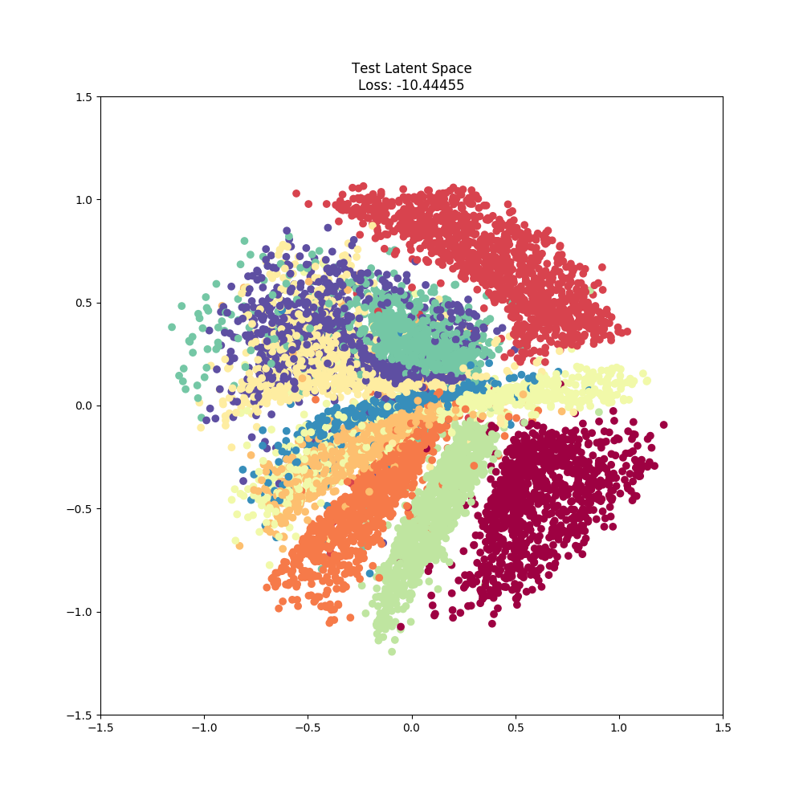
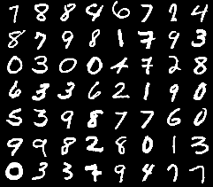
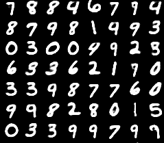
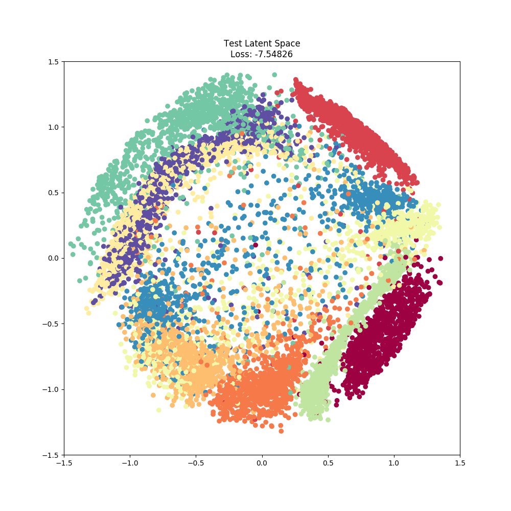
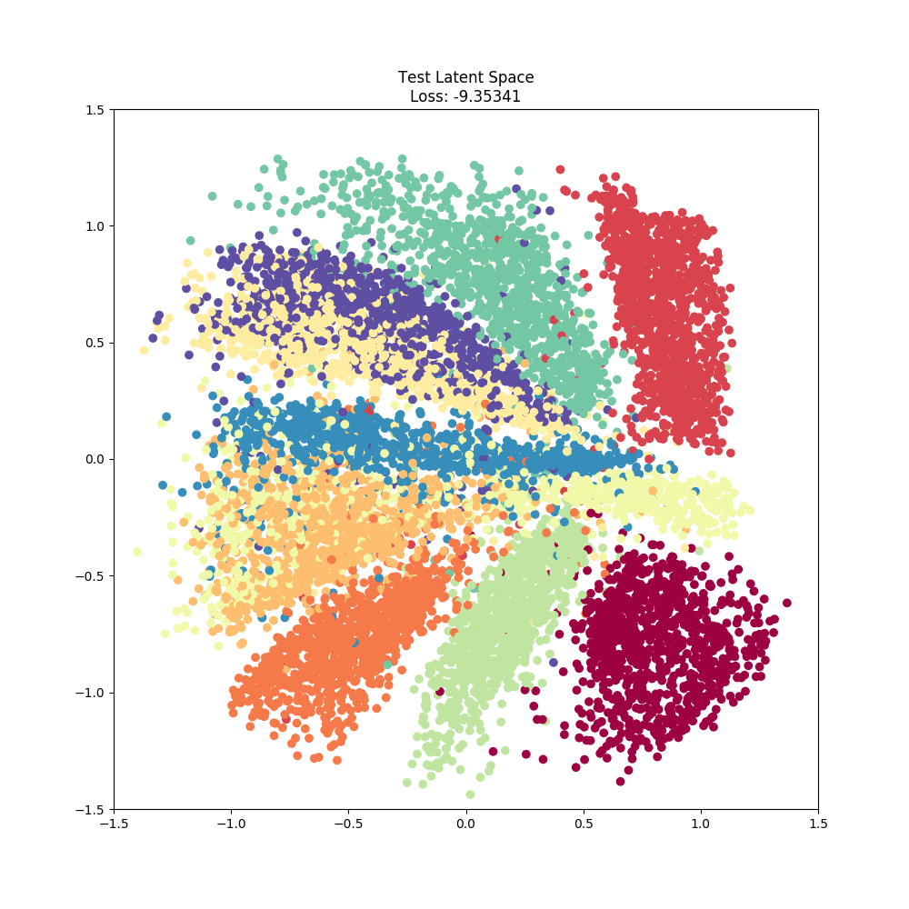
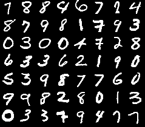
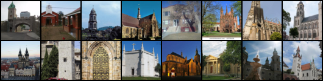

# Sliced-Wasserstein Autoencoder - PyTorch

Implementation of ["Sliced-Wasserstein Autoencoder: An Embarrassingly Simple Generative Model"](https://arxiv.org/abs/1804.01947) using PyTorch with reusable components.

## Quick Start

This repo requires `Python 3.x`.

To quickly get started training with the Sliced Wasserstein Autoencoder and running the MNIST example install the `swae` python package and dev dependencies.

1. Pull down this repo and run `pip install [-e] swae-pytorch/`
2. Change directories into the base of this repo and run `pip install -r requirements-dev.txt`
3. Run `python examples/mnist.py --datadir <place-to-save-data> --outdir <place-to-save-outputs>`

## Outputs

### MNIST

In the `mnist.py` example, three Sliced Wasserstein Autoencoders were each trained using one of the 2D distributions used in the original paper. Below are examples of each at the end of 30 epochs using the same optimization parameters. Minor discrpencies between the original Keras figures and the PyTorch ones below maybe attributed to unaccounted for defaults and/or initializations.

| 2D Latent Space | Test Samples | Reconstructions |
|:-------------------------:|:-------------------------:|:-------------------------:|
| |  |  |
| |  |  |
| |  |  |

### LSUN [Work In Progress]

In the `lsun.py` example, we attempt to show case how the Sliced Wasserstein Autoencoder performs on other datasets. Inspired by the original CelebA implementation in the Wasserstein Autoencoder paper, we rebuild an autoencoder similar to the architecture used in **DCGAN**. Additionally, we increase the number of projections to estimate the Sliced Wasserstein distance.

Due to limited compute resources, I am unable to effectively search the hyperparameter space at this time. Any help here would be greatly appreciated. Some ideas would be to implement some early stopping mechanism in PyTorch combined with some Random or Bayesian inspired search algorithm.

Below is the current state using: 500 projections, the Adam optimizer, sliced wasserstein distance weight of 10, and a 64 dimensional latent space with a gaussian prior.

| Test Samples | Reconstructions |
|:-------------------------:|:-------------------------:|
|  |  |

## References

### Code
- Original SWAE Keras implementation by [skolouri](https://github.com/skolouri/swae)
- Original WAE TensorFlow implementation [tolstikhin](https://github.com/tolstikhin/wae)

### Papers
- [Sliced-Wasserstein Autoencoder: An Embarrassingly Simple Generative Model](https://arxiv.org/abs/1804.01947)
- [Wasserstein Auto-Encoders](https://arxiv.org/abs/1711.01558)
- [Wasserstein Auto-Encoders: Latent Dimensionality and Random Encoders](https://openreview.net/pdf?id=r157GIJvz)
- [Learning Disentangled Representations with Wasserstein Auto-Encoders](https://openreview.net/pdf?id=Hy79-UJPM)
